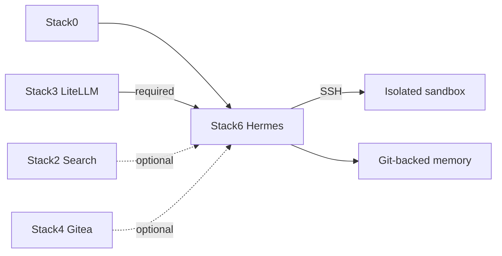

# Stack6 — Hermes

[Home](../README.md) · [Install](../INSTALLATION.md) · [DR](../bkp-dr/README.md) · [Pending](../pending.md)

Stack6 owns the Hermes agent, isolated execution sandbox and memory integration. It requires Stack0 + Stack3. Stack2 (`web.search`, `web.extract`) and Stack4 (`git.remote`) are optional providers.

Security boundary: Hermes has no Docker socket; execution is over SSH to the sandbox; the sandbox is not attached to `redlocal`; optional provider absence must fail closed rather than silently use cloud.

DR classification is intended to remain **reconstructable**. Caches, sessions, packages, logs, operational SQLite databases and sandbox state are disposable. Durable operator-valued memory/identity/knowledge must be authoritative in Git/Gitea. Externalization of remaining runtime-only knowledge, notably `SOUL.md` if still runtime-only, is the primary open DR blocker; see [`../pending.md`](../pending.md) and [`../bkp-dr/STATUS.md`](../bkp-dr/STATUS.md).
