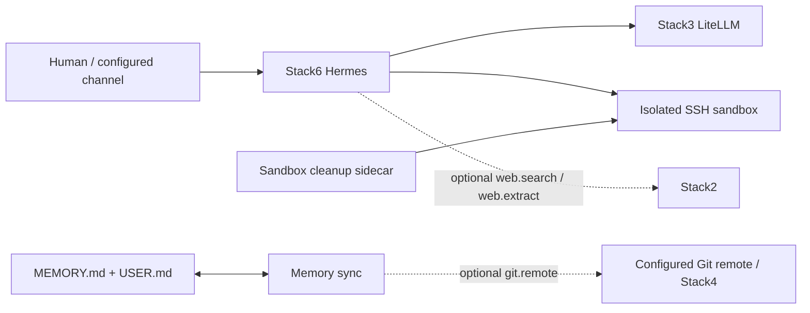
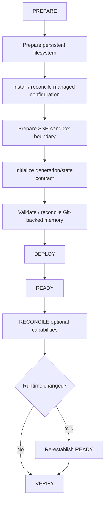

<!--
This Source Code Form is subject to the terms of the Mozilla Public
License, v. 2.0. If a copy of the MPL was not distributed with this
file, You can obtain one at https://mozilla.org/MPL/2.0/.
-->

# Stack6 — Hermes

[Documentation TOC](../docs/TOC.md) · [Stack map](../docs/stacks/README.md) · [Management plane](../docs/architecture/management-plane.md) · [OpenSpec contract](../docs/devel-docs/openspec/stacks/stack6.feature)

Stack6 is the agent runtime. It combines Hermes with isolated command execution, local-first AI access through Stack3, optional Stack2 web capabilities and portable Git-backed user memory.

## Contract

- **Requires:** Stack0 and Stack3.
- **Optional:** Stack2 `web.search` / `web.extract`; configured Git remote, commonly Stack4.
- **Owns:** Hermes runtime, sandbox execution surface and Stack6 maintenance sidecars.
- **DR:** runtime and sandbox are reconstructable. Durable user memory is the Git-backed `MEMORY.md` + `USER.md` contract and is verified as an external prerequisite rather than copied as arbitrary container state.

Stack2 is deliberately optional. When its provider capabilities are absent or not READY, Hermes web tools remain disabled. Reconciliation enables them only after the provider is proven ready.

## Isolation boundary

Hermes does **not** receive the Docker socket. Arbitrary command execution crosses a dedicated SSH boundary into the sandbox rather than becoming platform-level Docker control. The sandbox is attached to its private execution network and is not promoted to the shared service network merely for convenience.

Maintenance sidecars operate on Stack6-owned state only. Sandbox cleanup and reset semantics remain deterministic and do not grant Hermes broader platform administration.

The model/provider boundary is also externalized: Hermes talks to Stack3 through dedicated least-privilege gateway credentials instead of carrying provider master credentials itself.

## Preparation and convergence

Stack6 preparation is deliberately staged because filesystem ownership, managed configuration, SSH isolation, generation state and Git-backed memory have different failure and security properties.

Generation/state initialization is fail-closed: an incomplete or inconsistent sandbox generation is not treated as prepared merely because files exist. Capability reconciliation can restart runtime when configuration changes; readiness is therefore re-established after such a restart before verification succeeds.

A `.lock` means **PREPARED only**. It says nothing about Hermes health, sandbox readiness or optional capability convergence.

## Memory contract

Portable durable memory consists of the user-owned Git-backed files `MEMORY.md` and `USER.md`. Generated sandbox state, transient sessions and reconstructable runtime are not promoted to DR artifacts merely because they exist on disk.

Memory synchronization may use Stack4 Gitea when configured, but Stack6 does not require Stack4. The sync process uses its dedicated Git/SSH identity, does not force-push, fails on divergence, permits only the expected memory files to be dirty, and fast-forwards a clean working tree when the remote is ahead. These constraints preserve the Git repository as user-owned durable state rather than treating synchronization as authority to rewrite history.

## Deferred agent work

Hermes native Cron is the agentic deferred-work mechanism. A future Cron execution starts in a fresh session, so a scheduled prompt carries the context required to perform that future task. Deterministic housekeeping such as sandbox cleanup and Git-memory synchronization remains in dedicated sidecars rather than being delegated to agentic Cron.

## Related decisions and operator documentation

- [SDR-0002 — agent runtime without Docker socket](../docs/devel-docs/sdr/0002-agent-runtime-without-docker-socket.md)
- [SDR-0003 — least-privilege AI gateway credentials](../docs/devel-docs/sdr/0003-least-privilege-ai-gateway-credentials.md)
- [SDR-0004 — internal-only service networking](../docs/devel-docs/sdr/0004-internal-only-service-networking.md)
- [Hermes operator integration](../docs/user-docs/integrations/hermes.md)
- [Stack6 DR verifier/status](../docs/dr/status.md)

Key implementation files include `docker-compose.yml`, `config/hermes/config.yaml`, sandbox and maintenance configuration, `manifest.json`, and stack lifecycle scripts. Those files implement the contract; they are not independent public management interfaces.
