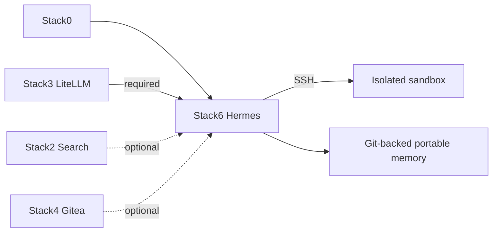

# Stack6 — Hermes

[Home](../README.md) · [Install](../INSTALLATION.md) · [DR](../bkp-dr/README.md) · [Pending](../pending.md)

Stack6 owns the Hermes agent, isolated execution sandbox and memory integration. It requires Stack0 + Stack3. Stack2 (`web.search`, `web.extract`) and Stack4 (`git.remote`) are optional providers.



Security boundary: Hermes has no Docker socket; execution is over SSH to the sandbox; the sandbox is not attached to `redlocal`; optional provider absence must fail closed rather than silently use cloud.

## Replaceability and persistence boundary

Hermes is deliberately **replaceable and reconstructable in its entirety**. Runtime files generated by Hermes are not promoted to durable platform state merely because they exist.

The only current durable application-level exception is portable user memory, externalized to Git:

```text
MEMORY.md   durable / mutable by memory sync
USER.md     durable / mutable by memory sync
```

Repository administration files such as `README.md` or `LICENSE` may also exist, but they are not runtime recovery state.

Everything else is disposable for DR, including:

- `SOUL.md` generated by the Hermes/Nous Research runtime;
- Hermes SQLite databases such as state, projects, kanban, response-store, idempotency and cron databases;
- caches, lazy packages, sessions and logs;
- the complete `service_-_hermes-sandbox` runtime tree, including workspace/state/home/logs;
- transient execution state and generated runtime files.

If a future Hermes version introduces additional files, databases or identity documents, they remain reconstructable by default. Persistence requires an explicit platform decision; Hermes itself does not define the DR boundary.

[`../bkp-dr/dr_stack6_verify.py`](../bkp-dr/dr_stack6_verify.py) provides the read-only DR proof for portable memory: configured Git origin/branch, tracked `MEMORY.md` + `USER.md`, clean working tree, and local HEAD aligned with the existing remote-tracking ref. It does not fetch, pull, commit, push or modify runtime.
