# Hermes Agent Stack — Architecture and Operations Guide

This document explains how the **Hermes agent stack** is assembled inside the `local_hybrid_ai` project, what each dependency does, where each component runs, how tools and skills are executed, why the isolated sandbox exists, and how **Buzz** turns Hermes into an agent that can be reached from an application instead of requiring the user to open the Hermes web interface.

The architecture has been validated from a clean `factory-reset`, including model inference, the SSH execution sandbox, web search, web extraction, Buzz messaging, and the temporary terminal-timeout workaround described later in this document.

## Table of contents

- [Hermes Agent Stack — Architecture and Operations Guide](#hermes-agent-stack--architecture-and-operations-guide)
  - [Table of contents](#table-of-contents)
  - [1. Design objective](#1-design-objective)
  - [2. High-level architecture](#2-high-level-architecture)
  - [3. Component responsibilities](#3-component-responsibilities)
    - [3.1 Hermes](#31-hermes)
  - [4. Where Hermes runs](#4-where-hermes-runs)
    - [4.1 `redlocal`](#41-redlocal)
    - [4.2 `hermes-exec`](#42-hermes-exec)
  - [5. LM Studio](#5-lm-studio)
  - [6. LiteLLM](#6-litellm)
  - [7. Why Hermes does not connect directly to LM Studio](#7-why-hermes-does-not-connect-directly-to-lm-studio)
  - [8. Hermes model configuration](#8-hermes-model-configuration)
  - [9. Hermes API and dashboard](#9-hermes-api-and-dashboard)
  - [10. The Hermes Agent API](#10-the-hermes-agent-api)
  - [11. The sandbox](#11-the-sandbox)
  - [12. Why the sandbox exists](#12-why-the-sandbox-exists)
  - [13. Where terminal commands execute](#13-where-terminal-commands-execute)
  - [14. SSH trust between Hermes and the sandbox](#14-ssh-trust-between-hermes-and-the-sandbox)
  - [15. Persistent filesystem layout](#15-persistent-filesystem-layout)
    - [15.1 Hermes](#151-hermes)
    - [15.2 Sandbox](#152-sandbox)
  - [16. Managed configuration versus runtime state](#16-managed-configuration-versus-runtime-state)
  - [17. `01-prepare.sh`](#17-01-preparesh)
  - [18. `02-cleanup.sh`](#18-02-cleanupsh)
  - [19. Clean installation flow](#19-clean-installation-flow)
  - [20. What Hermes skills are](#20-what-hermes-skills-are)
  - [21. What Hermes tools are](#21-what-hermes-tools-are)
    - [21.1 Terminal](#211-terminal)
    - [21.2 Web search](#212-web-search)
    - [21.3 Web extraction](#213-web-extraction)
    - [21.4 Model calls](#214-model-calls)
  - [22. Tool-location matrix](#22-tool-location-matrix)
  - [23. SearXNG](#23-searxng)
  - [24. Firecrawl](#24-firecrawl)
  - [25. Buzz](#25-buzz)
  - [26. Buzz end-to-end message flow](#26-buzz-end-to-end-message-flow)
  - [27. Why Buzz matters in this deployment](#27-why-buzz-matters-in-this-deployment)
  - [28. Buzz binary location](#28-buzz-binary-location)
  - [29. Buzz configuration](#29-buzz-configuration)
  - [30. Buzz pairing](#30-buzz-pairing)
  - [31. Buzz home channel](#31-buzz-home-channel)
  - [32. Buzz is not a model provider](#32-buzz-is-not-a-model-provider)
  - [33. Runtime `.env`](#33-runtime-env)
  - [34. Why runtime state is cleaned](#34-why-runtime-state-is-cleaned)
  - [35. Temporary terminal-timeout workaround](#35-temporary-terminal-timeout-workaround)
  - [36. `03-temporary-fix-issue-74116-terminal-timeout.sh`](#36-03-temporary-fix-issue-74116-terminal-timeoutsh)
  - [37. Why the workaround is a separate script](#37-why-the-workaround-is-a-separate-script)
  - [38. Timeout workaround validation](#38-timeout-workaround-validation)
  - [39. Example: ordinary conversation](#39-example-ordinary-conversation)
  - [40. Example: command execution](#40-example-command-execution)
  - [41. Example: web research](#41-example-web-research)
  - [42. Example: a skill using multiple tools](#42-example-a-skill-using-multiple-tools)
  - [43. Example: using Hermes from outside home](#43-example-using-hermes-from-outside-home)
  - [44. Validation strategy](#44-validation-strategy)
    - [44.1 Level 1 — direct connectivity](#441-level-1--direct-connectivity)
    - [44.2 Level 2 — real Hermes tool path](#442-level-2--real-hermes-tool-path)
  - [45. Validated paths](#45-validated-paths)
    - [45.1 Preparation](#451-preparation)
    - [45.2 Containers](#452-containers)
    - [45.3 Inference path](#453-inference-path)
    - [45.4 Execution path](#454-execution-path)
    - [45.5 Web tools](#455-web-tools)
    - [45.6 Buzz](#456-buzz)
    - [45.7 Reset and rebuild](#457-reset-and-rebuild)
    - [45.8 Known issue](#458-known-issue)
  - [46. Factory-reset reproducibility test](#46-factory-reset-reproducibility-test)
  - [47. Recommended operating procedure](#47-recommended-operating-procedure)
    - [47.1 First installation or clean rebuild](#471-first-installation-or-clean-rebuild)
    - [47.2 Normal start](#472-normal-start)
    - [47.3 Reset Hermes state](#473-reset-hermes-state)
    - [47.4 Factory reset](#474-factory-reset)
  - [48. Useful diagnostics](#48-useful-diagnostics)
    - [48.1 Container health](#481-container-health)
    - [48.2 Check deployed model](#482-check-deployed-model)
    - [48.3 Verify there is no unresolved model placeholder](#483-verify-there-is-no-unresolved-model-placeholder)
    - [48.4 Direct Hermes-to-sandbox SSH test](#484-direct-hermes-to-sandbox-ssh-test)
    - [48.5 Buzz channel access](#485-buzz-channel-access)
    - [48.6 Buzz gateway activity](#486-buzz-gateway-activity)
    - [48.7 Docker environment terminal timeout](#487-docker-environment-terminal-timeout)
    - [48.8 Hermes runtime terminal timeout](#488-hermes-runtime-terminal-timeout)
  - [49. Failure-domain troubleshooting](#49-failure-domain-troubleshooting)
    - [49.1 If model responses fail](#491-if-model-responses-fail)
    - [49.2 If terminal execution fails](#492-if-terminal-execution-fails)
    - [49.3 If search fails](#493-if-search-fails)
    - [49.4 If extraction fails](#494-if-extraction-fails)
    - [49.5 If Buzz fails](#495-if-buzz-fails)
  - [50. Security model](#50-security-model)
  - [51. Secret handling](#51-secret-handling)
  - [52. What this stack deliberately does not do](#52-what-this-stack-deliberately-does-not-do)
  - [53. Why this is local hybrid AI](#53-why-this-is-local-hybrid-ai)
  - [54. Architectural summary](#54-architectural-summary)
  - [55. Core principle](#55-core-principle)

## 1. Design objective

The central design principle is:

> **Hermes orchestrates. It does not need to be the model runtime, it must not execute arbitrary agent commands on the Docker host, and the user does not need to interact with it through a browser.**

Responsibilities are separated deliberately:

- **Hermes** is the AI agent and orchestrator.
- **LiteLLM** is the model-access and policy boundary.
- **LM Studio** runs the local language model.
- **hermes-sandbox** executes terminal commands in isolation.
- **SearXNG** provides search results.
- **Firecrawl** extracts webpage content.
- **Buzz** provides a remote/mobile conversational interface to Hermes.
- **HAProxy** optionally publishes the Hermes web dashboard through the existing internal TLS reverse-proxy layer.

The result is a local-first architecture in which the agent can use models and tools without receiving unnecessary control over the Docker host.

## 2. High-level architecture

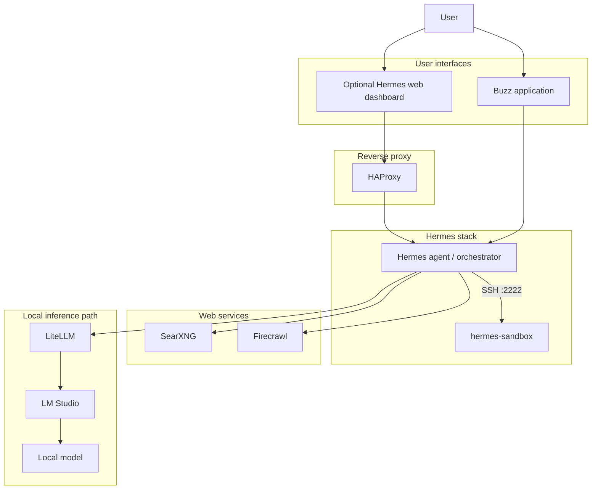

A useful summary is:

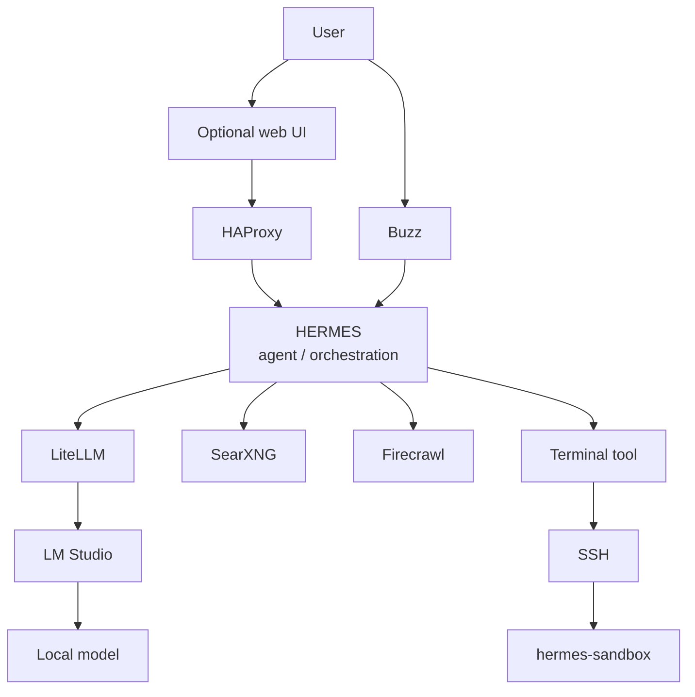

---

## 3. Component responsibilities

### 3.1 Hermes

Hermes runs in the Docker container:

```text
hermes
```

using:

```text
nousresearch/hermes-agent:latest
```

Hermes is the **agent layer**.

It is responsible for:

- receiving user messages;
- maintaining sessions and conversation state;
- deciding whether a request can be answered directly;
- deciding when a tool is required;
- calling the configured language model;
- invoking terminal operations;
- invoking web-search operations;
- invoking web-extraction operations;
- loading and applying skills;
- managing tool-calling loops;
- communicating through Buzz;
- optionally exposing the Hermes dashboard;
- optionally exposing the Hermes OpenAI-compatible agent API.

Hermes is **not** the model runtime.

Hermes is also **not** the execution sandbox.

It is the component that decides what should happen next.

---

## 4. Where Hermes runs

Hermes runs as a Docker container on the Docker host.

It is attached to:

```text
redlocal
hermes-exec
```

These networks have different purposes.

### 4.1 `redlocal`

`redlocal` is the existing external Docker bridge network used by infrastructure services.

Through this network Hermes can reach:

```text
litellm:4000
searxng:8080
firecrawl-api:3002
HAProxy
```

### 4.2 `hermes-exec`

`hermes-exec` is the private execution network shared only by the components that need the Hermes-to-sandbox path.

Conceptually:

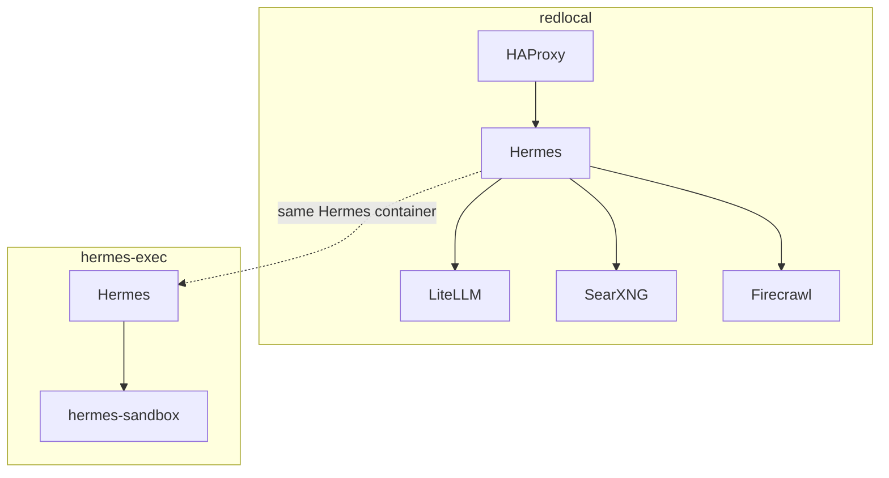

The sandbox therefore does not need to join the complete infrastructure network.

---

## 5. LM Studio

LM Studio is the **local model runtime**.

It is the component that actually has the local language model loaded in memory and performs inference.

Example model used during validation:

```text
google/gemma-4-e4b
```

The selected model is defined in the stack `.env`:

```dotenv
HERMES_MODEL=google/gemma-4-e4b
```

Hermes does not talk directly to LM Studio.

The model path is:

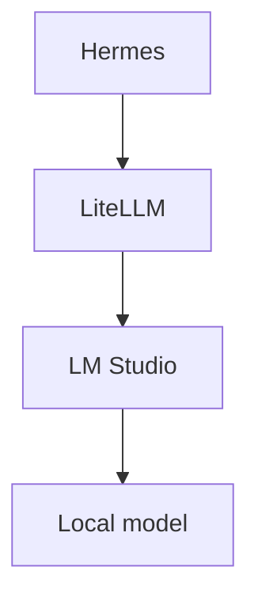

This separation is important because Hermes does not need to know:

- how LM Studio loads the model;
- where model files are stored;
- when models are unloaded;
- whether the physical backend changes in the future.

That responsibility belongs to the inference layer.

---

## 6. LiteLLM

LiteLLM sits between Hermes and LM Studio.

Hermes uses an OpenAI-compatible API endpoint:

```text
http://litellm:4000/v1
```

with a LiteLLM virtual API key.

The Hermes model block is conceptually:

```yaml
model:
  default: google/gemma-4-e4b
  provider: custom
  base_url: ${LITELLM_BASE_URL}
  api_key: ${LITELLM_API_KEY}
```

with:

```dotenv
LITELLM_BASE_URL=http://litellm:4000/v1
```

Architecture:

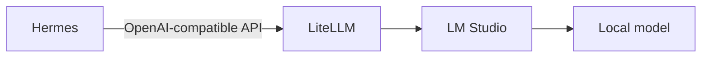

LiteLLM is an important boundary because it can provide:

- model aliases;
- provider abstraction;
- virtual API keys;
- model routing;
- access-control policies;
- quotas;
- logging;
- fallback policies;
- future local/cloud routing.

Hermes therefore asks for a logical model name, while LiteLLM decides how that request is actually satisfied.

---

## 7. Why Hermes does not connect directly to LM Studio

Direct Hermes-to-LM-Studio communication would work technically, but it would couple the agent to the inference runtime.

Using LiteLLM instead gives this separation:

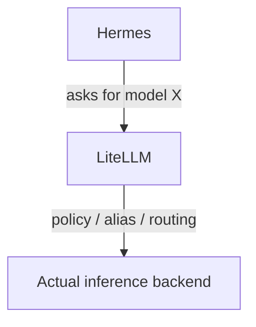

This means the inference backend can evolve independently from the agent.

For example, in the future LiteLLM could route:

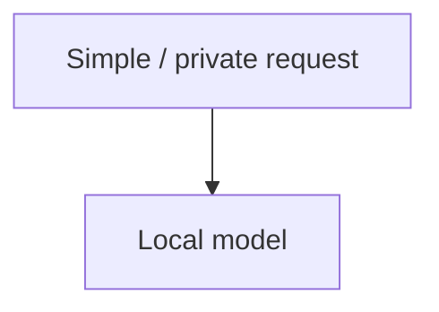

while an explicitly approved request could potentially use:

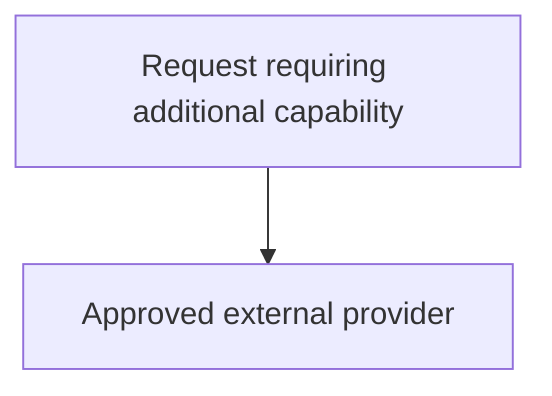

without changing Hermes itself.

That is why LiteLLM is the natural **policy boundary** of the hybrid architecture.

---

## 8. Hermes model configuration

The source Hermes configuration uses:

```yaml
model:
  default: ${HERMES_MODEL}
  provider: custom
  base_url: ${LITELLM_BASE_URL}
  api_key: ${LITELLM_API_KEY}
```

`HERMES_MODEL` remains defined in the stack `.env`.

During preparation, `01-prepare.sh` selectively renders the model into the deployed configuration.

Example:

```yaml
model:
  default: google/gemma-4-e4b
  provider: custom
  base_url: ${LITELLM_BASE_URL}
  api_key: ${LITELLM_API_KEY}
```

The reason for rendering only `HERMES_MODEL` is practical: a Hermes gateway execution path was observed not to resolve the literal `${HERMES_MODEL}` consistently.

The deployment therefore uses:

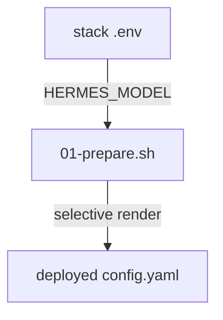

The selected model is still controlled from one place: the stack `.env`.

The model is not manually hardcoded throughout the configuration.

---

## 9. Hermes API and dashboard

Hermes exposes two internal services:

| Port | Service |
| --- | --- |
| `8642/tcp` | Hermes OpenAI-compatible agent API |
| `9119/tcp` | Hermes dashboard |

They are intentionally not published directly on the Docker host.

Typical `docker compose ps` output shows:

```text
8642/tcp, 9119/tcp
```

rather than host mappings such as:

```text
0.0.0.0:8642->8642/tcp
0.0.0.0:9119->9119/tcp
```

The optional dashboard is exposed through HAProxy:

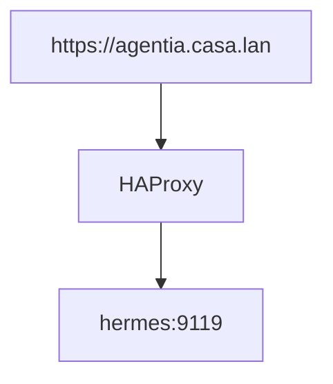

This keeps network publishing and TLS termination centralized.

---

## 10. The Hermes Agent API

Hermes can expose an OpenAI-compatible API on:

```text
http://hermes:8642/v1
```

or, from inside the same container:

```text
http://127.0.0.1:8642/v1
```

The API exposes the agent rather than the underlying model.

This distinction matters.

A response can therefore contain:

```json
{
  "model": "hermes-agent"
}
```

even though the actual inference model behind the agent is:

```text
google/gemma-4-e4b
```

The request path is:

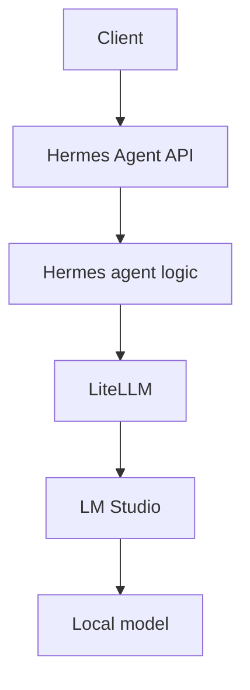

---

## 11. The sandbox

The sandbox runs in a separate Docker container:

```text
hermes-sandbox
```

It is not another Hermes instance.

It is not an AI model.

Its purpose is:

> **Provide an isolated Linux environment where commands requested by the Hermes terminal tool can execute.**

The sandbox runs SSH on:

```text
2222/tcp
```

inside Docker.

This port is not published directly on the Docker host.

Hermes reaches it over `hermes-exec` using:

| Parameter | Value |
| --- | --- |
| Host | `hermes-sandbox` |
| Port | `2222` |
| User | `agent` |

The sandbox user was validated as:

```text
uid=1000(agent)
gid=1000(agent)
```

---

## 12. Why the sandbox exists

An AI agent can generate commands such as:

```text
python script.py
pytest
git clone ...
grep ...
find ...
curl ...
npm install ...
make
```

Those commands should not automatically execute on the Docker host.

The architecture deliberately avoids giving Hermes:

```text
/var/run/docker.sock
```

and does not use:

```text
privileged: true
network_mode: host
Docker-in-Docker
direct host shell access
```

Instead:

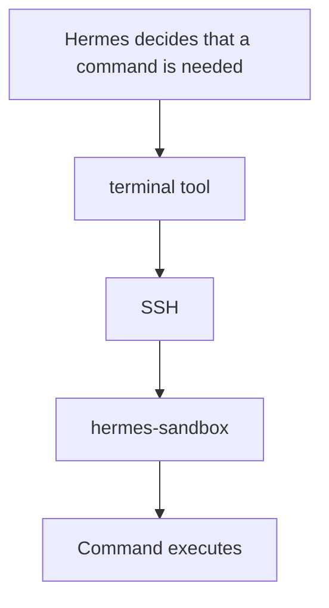

This provides a containment boundary between agent-generated commands and the host.

---

## 13. Where terminal commands execute

Hermes terminal configuration is:

```yaml
terminal:
  backend: ssh
  cwd: /workspace
  timeout: ${TERMINAL_TIMEOUT}
  persistent_shell: true
  env_passthrough: []
```

If the user asks:

```text
Run:
python test.py
```

the command does **not** execute:

- on the Docker host;
- inside the Hermes orchestration container.

It executes inside:

```text
hermes-sandbox
```

normally under:

```text
/workspace
```

The flow is:

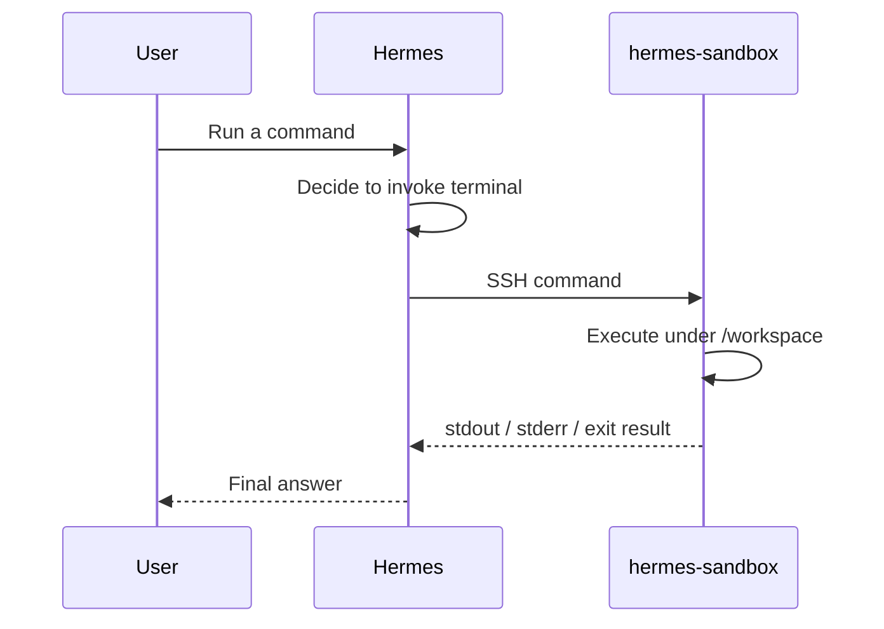

---

## 14. SSH trust between Hermes and the sandbox

Hermes maintains an SSH key pair at:

```text
/opt/docker/service_-_hermes/config/ssh/
├── hermes_executor_ed25519
└── hermes_executor_ed25519.pub
```

The public key is installed into the sandbox:

```text
/opt/docker/service_-_hermes-sandbox/data/home/.ssh/authorized_keys
```

The sandbox keeps its SSH host key under:

```text
/opt/docker/service_-_hermes-sandbox/config/ssh-host/
├── ssh_host_ed25519_key
└── ssh_host_ed25519_key.pub
```

This is deliberate.

The client identity and server identity are infrastructure state and survive normal resets.

---

## 15. Persistent filesystem layout

### 15.1 Hermes

```text
/opt/docker/service_-_hermes/
├── config/
│   ├── config.yaml
│   └── ssh/
│       ├── hermes_executor_ed25519
│       └── hermes_executor_ed25519.pub
├── data/
│   └── bin/
│       └── buzz
└── logs/
```

During runtime Hermes creates additional mutable content under:

```text
/opt/docker/service_-_hermes/data/
```

Examples observed include:

```text
.env
config.yaml
sessions/
state.db
memories/
cron/
skills/
hooks/
platforms/
pending_messages/
workspace/
cache/
kanban*
gateway_state.json
channel_directory.json
```

These are runtime artifacts.

They are not the authoritative deployment configuration.

### 15.2 Sandbox

```text
/opt/docker/service_-_hermes-sandbox/
├── config/
│   ├── Dockerfile
│   ├── entrypoint.sh
│   └── ssh-host/
│       ├── ssh_host_ed25519_key
│       └── ssh_host_ed25519_key.pub
├── data/
│   ├── home/
│   │   └── .ssh/
│   │       └── authorized_keys
│   └── workspace/
└── logs/
```

The sandbox workspace is mutable execution state.

The SSH host identity is infrastructure state.

---

## 16. Managed configuration versus runtime state

A key lesson from this deployment is the need to distinguish **managed configuration** from **runtime-generated state**.

The authoritative Hermes configuration is:

```text
/opt/docker/service_-_hermes/config/config.yaml
```

The stack manages that file.

Hermes can also create:

```text
/opt/docker/service_-_hermes/data/config.yaml
/opt/docker/service_-_hermes/data/.env
```

during runtime.

Those files must not be confused with the managed source of truth.

This distinction is one of the reasons the deployment uses separate scripts for **preparation** and **cleanup/reset**.

---

## 17. `01-prepare.sh`

`01-prepare.sh` prepares the deployment.

It does not start containers.

Its responsibilities include:

- checking `.lock`;
- reading and validating `.env`;
- proving `.env` is not modified;
- validating source files;
- validating the external Docker network;
- creating/verifying persistent directories;
- preserving legitimate persistent data;
- checking for stale shadow configuration;
- synchronizing the managed Hermes configuration;
- selectively rendering `HERMES_MODEL`;
- preserving SSH key pairs;
- recreating sandbox `authorized_keys`;
- validating dependencies;
- validating `docker compose config`;
- auditing ownership and permissions;
- auditing key coherence;
- creating `.lock` only after successful completion.

A successful preparation includes:

```text
arbol gestionado: OK
propietarios/permisos: OK
ficheros gestionados: OK
claves SSH: OK
modelo renderizado / shadow config: OK
.env inmutable: OK
```

The script deliberately does **not** delete runtime state.

That responsibility belongs to `02-cleanup.sh`.

---

## 18. `02-cleanup.sh`

`02-cleanup.sh` owns destructive state management.

Supported modes include:

| Mode | Purpose |
| --- | --- |
| *(default)* | Ordinary cleanup |
| `--reset-state` | Reset mutable agent state |
| `--factory-reset` | Remove all mutable Hermes and sandbox state |
| `--dry-run` | Show what would be removed, without removing it |
| `--yes` | Skip interactive confirmation |

A factory reset removes mutable Hermes and sandbox state, including examples such as:

```text
sessions
memories
state databases
pairing state
home-channel state
runtime .env
runtime config.yaml
workspace
logs
caches
cron data
runtime skills
pending messages
```

while preserving:

```text
/opt/docker/service_-_hermes/config
/opt/docker/service_-_hermes-sandbox/config
/opt/docker/service_-_hermes/data/bin
```

This means infrastructure survives, but mutable agent state can be rebuilt cleanly.

---

## 19. Clean installation flow

A clean installation follows:

```bash
cd /opt/docker/stack6_-_hermes

./01-prepare.sh

docker compose up -d --build

docker compose ps
```

Expected container status:

| Container | Status |
| --- | --- |
| `hermes` | healthy |
| `hermes-sandbox` | healthy |

While the current upstream timeout issue exists, apply:

```bash
./03-temporary-fix-issue-74116-terminal-timeout.sh
```

Then re-establish Buzz pairing if required.

---

## 20. What Hermes skills are

A Hermes **skill** belongs to the agent/orchestration layer.

A skill can contain:

- instructions;
- domain-specific procedures;
- task strategies;
- reusable workflows;
- guidance about when tools should be used.

A skill is not:

- another container;
- another model;
- another sandbox.

Conceptually:

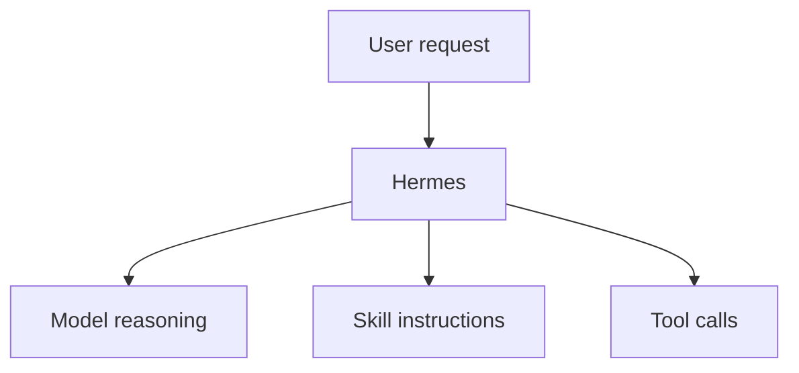

A skill can cause Hermes to invoke a tool, but it does not bypass the architecture.

For example:

```text
Skill says:
"Inspect this repository and run its tests."
```

The result is still:

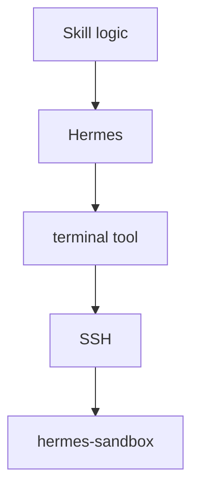

Therefore:

> **Skills are interpreted by Hermes; shell commands requested as part of a skill still execute in the sandbox.**

Runtime skill state can appear under:

```text
/opt/data/skills
```

inside the Hermes persistent data area.

---

## 21. What Hermes tools are

Tools are capabilities that Hermes can invoke.

Not every tool executes in the same place.

That distinction is essential.

### 21.1 Terminal

- Logical owner: `Hermes`
- Physical execution: `hermes-sandbox`
- Transport: `SSH`

### 21.2 Web search

- Logical owner: `Hermes`
- Backend: `SearXNG`
- Endpoint: `http://searxng:8080`

### 21.3 Web extraction

- Logical owner: `Hermes`
- Backend: `Firecrawl`
- Endpoint: `http://firecrawl-api:3002`

### 21.4 Model calls

- Logical owner: `Hermes`
- Backend path:

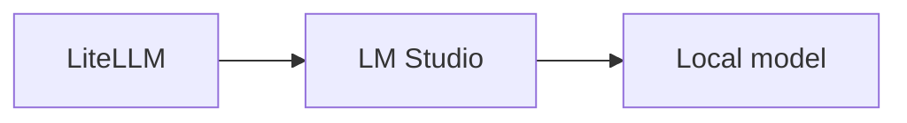

---

## 22. Tool-location matrix

| Capability | Decision made by | Actual execution / backend |
| --- | --- | --- |
| Language-model inference | Hermes | LiteLLM → LM Studio → local model |
| Terminal command | Hermes | `hermes-sandbox` over SSH |
| Web search | Hermes | SearXNG |
| Web extraction | Hermes | Firecrawl |
| Skill logic | Hermes | Hermes agent layer |
| User conversation via Buzz | Hermes / Buzz gateway | Buzz relay + Buzz app |
| Web dashboard | Hermes | Published through HAProxy |

This table is a useful troubleshooting reference.

---

## 23. SearXNG

Hermes uses SearXNG as the web-search backend.

Configuration:

```yaml
web:
  search_backend: searxng
```

Environment:

```dotenv
SEARXNG_URL=http://searxng:8080
```

The direct service path is:

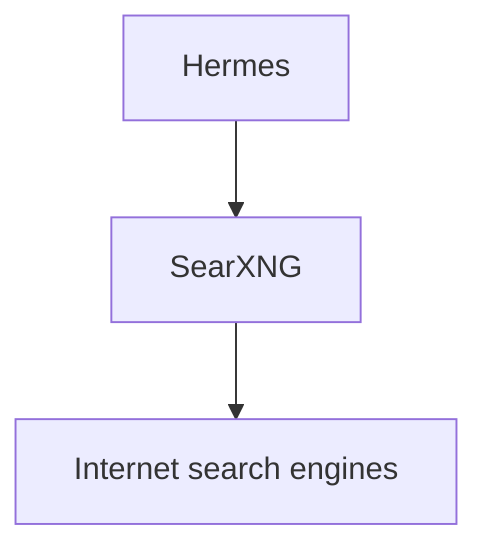

A direct connectivity test returned:

```text
HERMES_SEARXNG_OK
query: OpenAI
results: 40
first: OpenAI | Research & Deployment
```

A second test forced Hermes itself to use `web_search` and returned:

```text
HERMES_WEB_SEARCH_OK OpenAI | Research & Deployment
```

The second test is more important because it proves not just network connectivity but the real Hermes tool path.

---

## 24. Firecrawl

Hermes uses Firecrawl for webpage extraction.

Configuration:

```yaml
web:
  extract_backend: firecrawl
```

Environment:

```dotenv
FIRECRAWL_API_URL=http://firecrawl-api:3002
```

Flow:

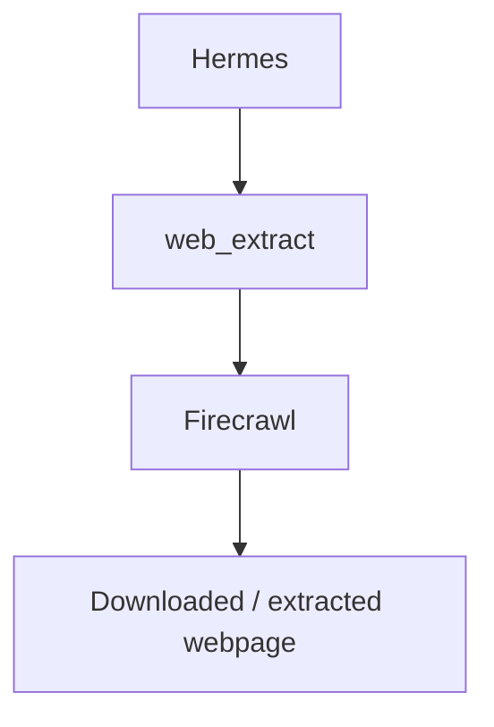

A direct scrape test returned:

```text
HERMES_FIRECRAWL_OK
success: True
markdown_chars: 180
contains_example_domain: True
```

Hermes was then forced to use its actual extraction tool and returned:

```text
HERMES_WEB_EXTRACT_OK Example Domain
```

Again, the second test validates the complete agent/tool path.

---

## 25. Buzz

Buzz has a completely different role from LiteLLM, LM Studio, SearXNG, Firecrawl or the sandbox.

Buzz is the **human communication channel**.

Its role is:

> **Allow the user to communicate with Hermes through an application from anywhere, instead of requiring the user to open a Hermes web chat.**

Without Buzz, the interaction model is approximately:

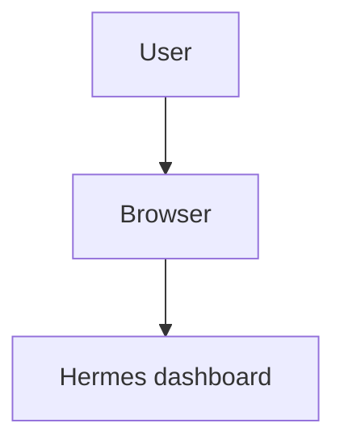

With Buzz:

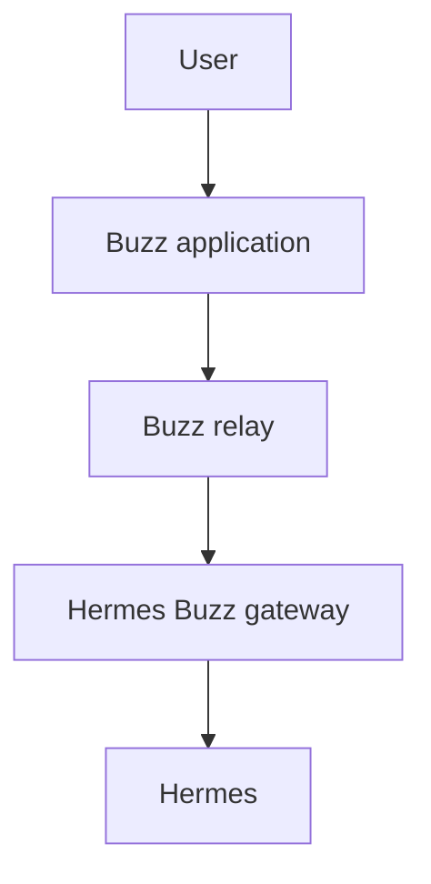

This makes Hermes usable more like a continuously reachable personal agent than a web page that must be opened manually.

---

## 26. Buzz end-to-end message flow

A real Buzz message follows:

```mermaid
sequenceDiagram
    participant U as User
    participant B as Buzz app
    participant R as Buzz relay
    participant H as Hermes
    participant L as LiteLLM
    participant LM as LM Studio
    participant M as Local model

    U->>B: Send message
    B->>R: Publish message
    R->>H: Buzz gateway inbound
    H->>L: Model request
    L->>LM: Route request
    LM->>M: Local inference
    M-->>LM: Generated result
    LM-->>L: Completion
    L-->>H: Completion
    H-->>R: Agent response
    R-->>B: Deliver response
    B-->>U: Display response
```

Therefore the real conversational path is:

```mermaid
flowchart TD
    B1["Buzz app"]
    R1["Buzz relay"]
    H1["Hermes"]
    L["LiteLLM"]
    LM["LM Studio"]
    M["Local model"]
    H2["Hermes"]
    B2["Buzz"]

    B1 --> R1
    R1 --> H1
    H1 --> L
    L --> LM
    LM --> M
    M --> H2
    H2 --> B2
```

Buzz does **not** perform AI inference.

Buzz transports the conversation.

---

## 27. Why Buzz matters in this deployment

The optional Hermes dashboard remains useful for:

- administration;
- local testing;
- diagnostics;
- direct interaction.

But it is not the intended everyday interface.

Buzz makes possible scenarios such as:

```mermaid
flowchart TD
    A["User leaves home"]
    B["Opens Buzz on another network"]
    C["Asks Hermes a question"]
    D["Hermes uses local inference at home"]
    E["Answer returns to Buzz"]

    A --> B
    B --> C
    C --> D
    D --> E
```

The important point is:

> The AI can remain local while the conversational interface is available remotely.

The local model does not need to be exposed publicly.

LiteLLM does not need to be exposed publicly.

The sandbox does not need to be exposed publicly.

The user talks to the agent through Buzz.

---

## 28. Buzz binary location

The Buzz CLI binary is kept persistently at:

| Context | Path |
| --- | --- |
| Host | `/opt/docker/service_-_hermes/data/bin/buzz` |
| Hermes container | `/opt/data/bin/buzz` |

`data/bin` is intentionally preserved by `02-cleanup.sh --factory-reset`.

This avoids reinstalling the Buzz CLI after every reset.

---

## 29. Buzz configuration

Buzz integration uses environment variables such as:

```text
BUZZ_CLI_PATH
BUZZ_RELAY_URL
BUZZ_PRIVATE_KEY
BUZZ_AUTH_TAG
```

Actual secret values belong in the stack `.env`.

They must never be committed to Git.

The stack `.env` is the deployment source of truth and is treated as read-only by `01-prepare.sh`.

---

## 30. Buzz pairing

A clean `reset-state` or `factory-reset` removes Buzz pairing state.

Pairing must then be approved again.

Command:

```bash
docker exec hermes hermes pairing approve buzz <PAIRING_CODE>
```

Example syntax:

```bash
docker exec hermes hermes pairing approve buzz 7F4TTKXM
```

The actual code must come from the current pairing request.

---

## 31. Buzz home channel

Buzz can designate a channel as Hermes' home channel.

From the chosen Buzz conversation:

```text
/sethome
```

Hermes can then confirm:

```text
Home channel set to DM.
Cron jobs and cross-platform messages will be delivered here.
```

This is significant for future proactive behavior.

For example:

```mermaid
flowchart TD
    A["Scheduled Hermes task"]
    B["Hermes produces result"]
    C["Buzz home channel"]
    D["User receives it in the app"]

    A --> B
    B --> C
    C --> D
```

The home channel therefore turns Buzz into more than a request/response chat.

It can become the destination for scheduled or cross-platform agent messages.

---

## 32. Buzz is not a model provider

A useful responsibility map is:

| Component | Role |
| --- | --- |
| Buzz | How the user talks to Hermes |
| Hermes | The agent |
| LiteLLM | How Hermes reaches models |
| LM Studio | Where the local model runs |
| hermes-sandbox | Where shell commands execute |
| SearXNG | Where searches are sent |
| Firecrawl | Where webpages are extracted |
| HAProxy | How the optional web dashboard is exposed |

Keeping these roles separate avoids a lot of architectural confusion.

---

## 33. Runtime `.env`

Hermes creates:

```text
/opt/data/.env
```

during startup.

A clean deployment showed the following variable names:

```text
BROWSERBASE_ADVANCED_STEALTH
BROWSERBASE_PROXIES
BROWSER_INACTIVITY_TIMEOUT
BROWSER_SESSION_TIMEOUT
IMAGE_TOOLS_DEBUG
MOA_TOOLS_DEBUG
TERMINAL_LIFETIME_SECONDS
TERMINAL_MODAL_IMAGE
TERMINAL_TIMEOUT
VISION_TOOLS_DEBUG
WEB_TOOLS_DEBUG
```

Importantly, the clean runtime file did **not** contain:

```text
HERMES_MODEL
LITELLM_BASE_URL
LITELLM_API_KEY
BUZZ_RELAY_URL
BUZZ_PRIVATE_KEY
BUZZ_AUTH_TAG
SEARXNG_URL
FIRECRAWL_API_URL
```

Therefore the runtime `.env` is not simply a copy of the stack `.env`.

It is internal Hermes runtime state.

---

## 34. Why runtime state is cleaned

A stale runtime `.env` had previously contained obsolete values from an older installation state.

That created precedence problems.

For this reason the deployment treats:

```text
/opt/data/.env
```

as disposable runtime state.

During controlled reset, `02-cleanup.sh` removes it.

During the next start Hermes is allowed to recreate it.

This prevents obsolete runtime values from surviving indefinitely.

---

## 35. Temporary terminal-timeout workaround

A current Hermes issue causes the generated runtime file to contain:

```dotenv
TERMINAL_TIMEOUT=60
```

even though the stack correctly provides:

```dotenv
TERMINAL_TIMEOUT=300
```

and the managed configuration contains:

```yaml
terminal:
  timeout: ${TERMINAL_TIMEOUT}
```

This is not merely cosmetic.

It was functionally tested.

Before the workaround, Hermes was asked to run:

```bash
sleep 70; printf TERMINAL_TIMEOUT_GT60_OK
```

and the terminal returned:

```text
[Command timed out after 60s]
```

Therefore the effective terminal timeout was genuinely 60 seconds.

---

## 36. `03-temporary-fix-issue-74116-terminal-timeout.sh`

The workaround is deliberately isolated in:

```text
03-temporary-fix-issue-74116-terminal-timeout.sh
```

This is preferable to modifying the working deployment scripts or managed configuration.

The script:

1. reads the desired `TERMINAL_TIMEOUT` from the running Hermes container;
2. reads the Hermes runtime `.env`;
3. verifies that exactly one `TERMINAL_TIMEOUT` entry exists;
4. replaces only that value;
5. preserves ownership and permissions;
6. restarts only Hermes;
7. waits for Hermes to become healthy;
8. verifies the runtime value survived the restart.

The script therefore does **not** hardcode `300`.

If the stack `.env` later contains:

```dotenv
TERMINAL_TIMEOUT=600
```

the temporary fix can propagate `600`.

The stack `.env` remains the source of truth.

---

## 37. Why the workaround is a separate script

The following files are already known to be architecturally correct:

```text
.env
config/hermes/config.yaml
docker-compose.yml
01-prepare.sh
02-cleanup.sh
```

Changing them to accommodate a temporary upstream bug would mix permanent architecture with temporary technical debt.

Instead, `03-temporary-fix-issue-74116-terminal-timeout.sh` contains the entire workaround.

Once upstream behavior is corrected and verified, the desired cleanup is simply:

```bash
rm 03-temporary-fix-issue-74116-terminal-timeout.sh
```

No architectural rollback should be required.

---

## 38. Timeout workaround validation

After running:

```bash
./03-temporary-fix-issue-74116-terminal-timeout.sh
```

the script verified:

```text
Docker environment TERMINAL_TIMEOUT=300
Hermes runtime TERMINAL_TIMEOUT=60
Applying temporary workaround: 60 -> 300
Runtime .env now contains TERMINAL_TIMEOUT=300
Restarting Hermes...
Hermes is healthy.
Post-restart verification: TERMINAL_TIMEOUT=300
```

The functional test was then repeated:

```bash
sleep 70; printf TERMINAL_TIMEOUT_GT60_OK
```

Hermes returned:

```text
TERMINAL_TIMEOUT_GT60_OK
```

The complete request took approximately **85.9 seconds**, including:

- model inference;
- tool selection;
- the 70-second command;
- result processing;
- final model response.

This proves the effective terminal timeout is now greater than 60 seconds.

---

## 39. Example: ordinary conversation

User asks through Buzz:

```text
Explain how mTLS works.
```

No tools are required.

Flow:

```mermaid
flowchart TD
    U1["User"]
    B1["Buzz"]
    H1["Hermes"]
    L["LiteLLM"]
    LM["LM Studio"]
    M["Local model"]
    H2["Hermes"]
    B2["Buzz"]
    U2["User"]

    U1 --> B1
    B1 --> H1
    H1 --> L
    L --> LM
    LM --> M
    M --> H2
    H2 --> B2
    B2 --> U2
```

The sandbox is not involved.

SearXNG is not involved.

Firecrawl is not involved.

---

## 40. Example: command execution

User asks:

```text
Create a Python script that parses this JSON and test it.
```

Possible flow:

```mermaid
flowchart TD
    U1["User"]
    H1["Hermes"]
    R["Model reasoning"]
    T["terminal tool"]
    S["SSH"]
    SB["hermes-sandbox"]
    C1["Create file"]
    C2["Execute Python"]
    C3["Run test"]
    RES["Result"]
    H2["Hermes"]
    U2["User"]

    U1 --> H1
    H1 --> R
    H1 --> T
    T --> S
    S --> SB
    SB --> C1
    SB --> C2
    SB --> C3
    C1 --> RES
    C2 --> RES
    C3 --> RES
    RES --> H2
    H2 --> U2
```

The command never needs to execute on the Docker host.

---

## 41. Example: web research

User asks:

```text
Search for the latest documentation for project X and summarize the relevant page.
```

Possible flow:

```mermaid
flowchart TD
    H["Hermes"]
    WS["web_search"]
    SX["SearXNG"]
    URLS["Result URLs"]
    WE["web_extract"]
    FC["Firecrawl"]
    P["Extracted webpage"]
    H2["Hermes"]
    M["Model"]

    H --> WS
    WS --> SX
    SX --> URLS
    URLS --> WE
    H --> WE
    WE --> FC
    FC --> P
    P --> H2
    H2 --> M
```

The search and extraction functions remain separate services.

---

## 42. Example: a skill using multiple tools

Suppose a skill instructs Hermes to:

1. Search for the official documentation.
2. Extract the relevant page.
3. Create a sample configuration.
4. Run a validation command.

The result can be:

```mermaid
flowchart TD
    SK["Skill instructions"]
    H["Hermes"]
    WS["web_search"]
    SX["SearXNG"]
    WE["web_extract"]
    FC["Firecrawl"]
    MO["model"]
    L["LiteLLM"]
    LM["LM Studio"]
    T["terminal"]
    S["SSH"]
    SB["hermes-sandbox"]

    SK --> H
    H --> WS
    WS --> SX
    H --> WE
    WE --> FC
    H --> MO
    MO --> L
    L --> LM
    H --> T
    T --> S
    S --> SB
```

The skill coordinates the workflow.

It does not bypass the security boundaries.

---

## 43. Example: using Hermes from outside home

This is the practical reason Buzz exists in the stack.

The user is away from home and sends in the Buzz app:

```text
Check whether the project tests still pass and summarize the result.
```

Possible flow:

```mermaid
flowchart TD
    U1["User"]
    B1["Buzz application"]
    R1["Buzz relay"]
    H["Hermes at home"]
    L["Local model through LiteLLM / LM Studio"]
    T["terminal tool if required"]
    SB["hermes-sandbox"]
    F["Final response"]
    R2["Buzz relay"]
    B2["Buzz application"]
    U2["User"]

    U1 --> B1
    B1 --> R1
    R1 --> H
    H --> L
    H --> T
    T --> SB
    L --> F
    SB --> F
    F --> R2
    R2 --> B2
    B2 --> U2
```

The user does not have to browse to:

```text
https://agentia.casa.lan
```

The local inference environment does not have to be publicly exposed.

The agent remains local while the conversational interface is remote.

---

## 44. Validation strategy

The stack was not considered valid merely because `docker compose ps` showed `healthy`.

Each dependency was tested at two levels whenever possible.

### 44.1 Level 1 — direct connectivity

Examples:

```text
Hermes -> LiteLLM
Hermes -> SearXNG
Hermes -> Firecrawl
Hermes -> sandbox SSH
```

This proves networking, DNS, ports and basic authentication.

### 44.2 Level 2 — real Hermes tool path

Examples:

```text
Hermes agent -> terminal tool -> sandbox
Hermes agent -> web_search -> SearXNG
Hermes agent -> web_extract -> Firecrawl
Buzz -> Hermes -> model -> Buzz
```

This proves that Hermes itself is actually using the configured backend.

The distinction is important.

A successful `curl` does not prove a Hermes tool is configured correctly.

A successful manual SSH command does not prove Hermes' terminal backend uses SSH.

---

## 45. Validated paths

### 45.1 Preparation

| Item | Result |
| --- | --- |
| `01-prepare.sh` | OK |
| `.env` immutability | OK |
| Managed config | OK |
| `HERMES_MODEL` rendering | OK |

### 45.2 Containers

| Item | Result |
| --- | --- |
| Hermes | healthy |
| `hermes-sandbox` | healthy |

### 45.3 Inference path

| Item | Result |
| --- | --- |
| Hermes → LiteLLM | OK |
| LiteLLM → LM Studio | OK |
| LM Studio → local model | OK |
| Hermes Agent API | OK |

### 45.4 Execution path

| Item | Result |
| --- | --- |
| Hermes → sandbox SSH | OK |
| Hermes terminal tool → sandbox | OK |

### 45.5 Web tools

| Item | Result |
| --- | --- |
| Hermes → SearXNG | OK |
| Hermes `web_search` tool | OK |
| Hermes → Firecrawl | OK |
| Hermes `web_extract` tool | OK |

### 45.6 Buzz

| Item | Result |
| --- | --- |
| Buzz CLI | OK |
| Buzz relay | OK |
| Buzz inbound | OK |
| Buzz → Hermes → local model | OK |
| Buzz outbound | OK |
| Buzz home channel | OK |

### 45.7 Reset and rebuild

| Item | Result |
| --- | --- |
| Factory reset | OK |
| Clean prepare after reset | OK |
| Clean rebuild | OK |

### 45.8 Known issue

| Item | Result |
| --- | --- |
| Issue #74116 workaround | OK |
| Effective terminal timeout > 60 s | OK |

---

## 46. Factory-reset reproducibility test

A complete destructive reset was deliberately performed:

```bash
docker compose stop

rm .lock

./02-cleanup.sh --factory-reset

./01-prepare.sh

docker compose up -d --build
```

After rebuild:

| Container | Status |
| --- | --- |
| `hermes` | healthy |
| `hermes-sandbox` | healthy |

The managed model configuration showed:

```yaml
model:
  default: google/gemma-4-e4b
  provider: custom
  base_url: ${LITELLM_BASE_URL}
  api_key: ${LITELLM_API_KEY}
```

No literal `${HERMES_MODEL}` remained in the deployed configuration.

Hermes was then forced to use its terminal backend and returned:

```text
FACTORY_RESET_REBUILD_OK
```

This demonstrated that the deployment does not depend on accidental historical state.

---

## 47. Recommended operating procedure

### 47.1 First installation or clean rebuild

```bash
cd /opt/docker/stack6_-_hermes

./01-prepare.sh

docker compose up -d --build

docker compose ps

./03-temporary-fix-issue-74116-terminal-timeout.sh
```

Then complete Buzz pairing if required:

```bash
docker exec hermes hermes pairing approve buzz <PAIRING_CODE>
```

From the desired Buzz DM/channel:

```text
/sethome
```

### 47.2 Normal start

If the persistent state is already valid:

```bash
cd /opt/docker/stack6_-_hermes

docker compose up -d --build

docker compose ps
```

If Hermes recreates the affected runtime timeout value after a clean rebuild, apply the temporary workaround:

```bash
./03-temporary-fix-issue-74116-terminal-timeout.sh
```

### 47.3 Reset Hermes state

```bash
# Stop the stack
docker compose stop

# Remove the deliberate preparation lock
rm .lock

# Reset mutable state
./02-cleanup.sh --reset-state

# Prepare again
./01-prepare.sh

# Start
docker compose up -d --build

# Apply the temporary workaround
./03-temporary-fix-issue-74116-terminal-timeout.sh
```

Re-pair Buzz and run `/sethome` if the reset removed those states.

### 47.4 Factory reset

```bash
docker compose stop

rm .lock

./02-cleanup.sh --factory-reset

./01-prepare.sh

docker compose up -d --build

./03-temporary-fix-issue-74116-terminal-timeout.sh
```

Then re-establish Buzz pairing and home-channel configuration.

---

## 48. Useful diagnostics

### 48.1 Container health

```bash
docker compose ps
```

Expected:

| Container | Status |
| --- | --- |
| `hermes` | healthy |
| `hermes-sandbox` | healthy |

### 48.2 Check deployed model

```bash
grep -nA4 '^model:' \
  /opt/docker/service_-_hermes/config/config.yaml
```

Expected structure:

```yaml
model:
  default: google/gemma-4-e4b
  provider: custom
  base_url: ${LITELLM_BASE_URL}
  api_key: ${LITELLM_API_KEY}
```

### 48.3 Verify there is no unresolved model placeholder

```bash
grep -nF '${HERMES_MODEL}' \
  /opt/docker/service_-_hermes/config/config.yaml \
  || echo 'OK: no queda ${HERMES_MODEL} literal'
```

### 48.4 Direct Hermes-to-sandbox SSH test

```bash
docker exec hermes sh -lc '
ssh \
  -i "$TERMINAL_SSH_KEY" \
  -p "$TERMINAL_SSH_PORT" \
  -o StrictHostKeyChecking=no \
  -o UserKnownHostsFile=/dev/null \
  "$TERMINAL_SSH_USER@$TERMINAL_SSH_HOST" \
  "printf \"HERMES_SANDBOX_OK\n\"; id; pwd"
'
```

Expected:

```text
HERMES_SANDBOX_OK
uid=1000(agent) gid=1000(agent) ...
/home/agent
```

### 48.5 Buzz channel access

```bash
docker exec hermes sh -lc '"$BUZZ_CLI_PATH" channels list'
```

### 48.6 Buzz gateway activity

```bash
docker exec hermes hermes logs gateway 2>&1 | \
  grep -Ei 'buzz|pair|relay|inbound|response|error|warning' | \
  tail -100
```

### 48.7 Docker environment terminal timeout

```bash
docker exec hermes sh -lc '
printf "TERMINAL_TIMEOUT=%s\n" "$TERMINAL_TIMEOUT"
'
```

### 48.8 Hermes runtime terminal timeout

```bash
grep -E '^(export[[:space:]]+)?TERMINAL_TIMEOUT=' \
  /opt/docker/service_-_hermes/data/.env
```

While the workaround is required, both values should agree after running:

```bash
./03-temporary-fix-issue-74116-terminal-timeout.sh
```

---

## 49. Failure-domain troubleshooting

The architecture is deliberately modular.

### 49.1 If model responses fail

```mermaid
flowchart TD
    H["Hermes"]
    A{"LiteLLM reachable?"}
    B{"Correct virtual key?"}
    C{"Model alias exists?"}
    D{"LM Studio reachable?"}
    E{"Model loaded?"}

    H --> A
    A --> B
    B --> C
    C --> D
    D --> E
```

### 49.2 If terminal execution fails

```mermaid
flowchart TD
    H["Hermes"]
    A{"terminal backend = ssh?"}
    B{"SSH key readable?"}
    C{"hermes-exec network healthy?"}
    D{"hermes-sandbox healthy?"}
    E{"sshd listening on 2222?"}

    H --> A
    A --> B
    B --> C
    C --> D
    D --> E
```

### 49.3 If search fails

```mermaid
flowchart TD
    H["Hermes"]
    A{"SEARXNG_URL correct?"}
    B{"SearXNG healthy?"}

    H --> A
    A --> B
```

### 49.4 If extraction fails

```mermaid
flowchart TD
    H["Hermes"]
    A{"FIRECRAWL_API_URL correct?"}
    B{"Firecrawl healthy?"}

    H --> A
    A --> B
```

### 49.5 If Buzz fails

```mermaid
flowchart TD
    B["Buzz app"]
    A{"Relay reachable?"}
    C{"Buzz credentials valid?"}
    D{"Pairing valid?"}
    E{"Hermes gateway running?"}
    F{"Model path healthy?"}

    B --> A
    A --> C
    C --> D
    D --> E
    E --> F
```

---

## 50. Security model

The stack intentionally avoids several common high-risk shortcuts.

Hermes does **not** receive:

```text
Docker socket
privileged mode
host networking
direct root shell on the host
```

The sandbox contains command execution.

LiteLLM contains model-provider policy.

HAProxy contains web exposure.

Buzz contains the remote conversational interface.

This produces several independent boundaries:

| Boundary | Component |
| --- | --- |
| Human communication | Buzz |
| Agent / orchestration | Hermes |
| Model policy | LiteLLM |
| Inference | LM Studio |
| Execution | `hermes-sandbox` |
| Web search | SearXNG |
| Web extraction | Firecrawl |
| Network / TLS exposure | HAProxy |

---

## 51. Secret handling

Secrets belong in the stack `.env`.

Examples include:

```text
LITELLM_API_KEY
API_SERVER_KEY
BUZZ_PRIVATE_KEY
BUZZ_AUTH_TAG
```

They must never be committed to the repository.

`01-prepare.sh` treats `.env` as read-only and verifies that it was not modified.

A manually maintained deployment-secret file must **not** be created under:

```text
/opt/data/.env
```

Hermes may create its own runtime `.env`, but that file is internal runtime state and is cleaned during reset.

---

## 52. What this stack deliberately does not do

This deployment intentionally does not:

- give Hermes direct Docker control;
- mount `/var/run/docker.sock`;
- run the sandbox privileged;
- use host networking;
- expose sandbox SSH on a host port;
- expose Hermes API/dashboard ports directly on the host;
- require Hermes to know LM Studio implementation details;
- make the Hermes browser interface the primary everyday chat interface;
- hardcode the selected model across multiple configuration files;
- rely on stale runtime state;
- send all inference to a cloud provider by default.

---

## 53. Why this is local hybrid AI

The currently validated inference path is local:

```mermaid
flowchart TD
    H["Hermes"]
    L["LiteLLM"]
    LM["LM Studio"]
    M["Local model"]

    H --> L
    L --> LM
    LM --> M
```

The architecture is called hybrid because the model-access boundary is abstracted.

LiteLLM can remain local-only, or later be given explicitly approved additional providers.

Hybrid does **not** mean:

```text
send every request to the cloud
```

It means:

```mermaid
flowchart TD
    A["Local by default"]
    B["Use additional capability only when policy allows it"]

    A --> B
```

This preserves sovereignty over the normal inference path while keeping architectural flexibility.

---

## 54. Architectural summary

The user communicates through Buzz.
Buzz delivers messages to Hermes.
Hermes decides what the task requires.

| If the task requires... | The path is |
| --- | --- |
| Reasoning | Hermes → LiteLLM → LM Studio → local model |
| Shell execution | Hermes → SSH → `hermes-sandbox` |
| Search | Hermes → SearXNG |
| Webpage extraction | Hermes → Firecrawl |
| The optional dashboard | User → HAProxy → Hermes |

Skills remain part of the Hermes agent layer.

Skills may request tools.

Tools still respect their execution boundaries.

The responsibility map is:

| Component | Responsibility |
| --- | --- |
| Hermes | Agent reasoning, sessions, orchestration and tool selection |
| LiteLLM | Model abstraction, access control and routing/policy boundary |
| LM Studio | Local model runtime |
| Local model | Language inference |
| `hermes-sandbox` | Isolated shell/command execution |
| SearXNG | Web search |
| Firecrawl | Webpage extraction |
| Buzz | Remote/mobile conversational interface |
| HAProxy | Optional TLS/reverse-proxy exposure of the Hermes dashboard |

---

## 55. Core principle

The architecture can be summarized in eight short statements:

```text
The model generates.
Hermes orchestrates.
LiteLLM routes.
LM Studio runs the local model.
The sandbox executes.
SearXNG searches.
Firecrawl extracts.
Buzz communicates.
```

That separation makes the system easier to:

- secure;
- understand;
- test;
- troubleshoot;
- reproduce;
- replace component by component;
- evolve without redesigning the whole stack.

Most importantly, it allows a locally hosted AI agent to remain **local-first and controlled**, while still being reachable by the user through an application from virtually anywhere.