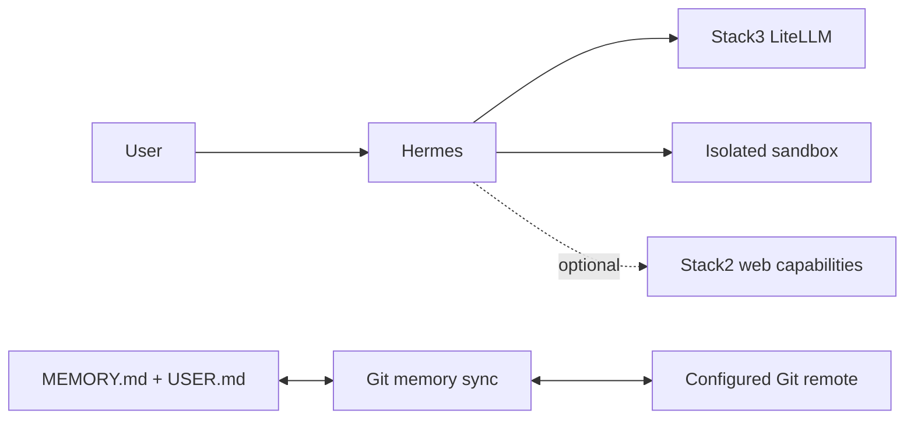

# Stack6 — Hermes

Agent stack with isolated command execution and portable Git-backed user memory.

**Requires:** Stack0 + Stack3.  
**Optional:** Stack2 `web.search` / `web.extract`; configured Git remote.  
**DR:** Hermes runtime and sandbox are reconstructable. Durable user memory is only Git-backed `MEMORY.md` + `USER.md` and is verified as an external prerequisite.

Hermes does not receive the Docker socket; see [../sdr/0002-agent-runtime-without-docker-socket.md](../sdr/0002-agent-runtime-without-docker-socket.md). Integration details are in [integrations.md](integrations.md).
