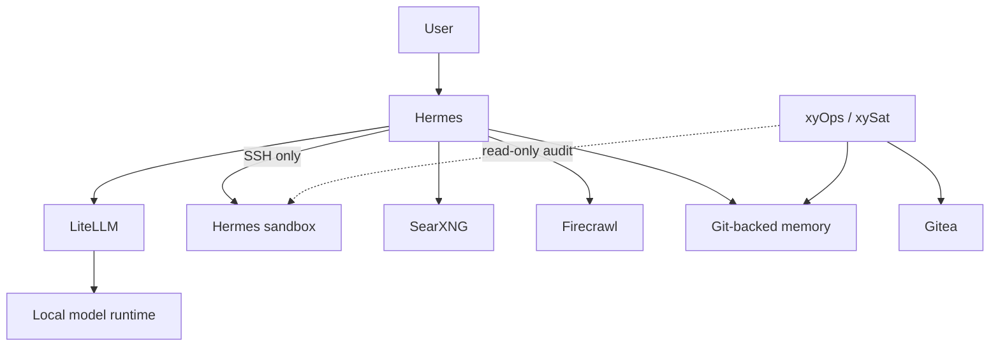
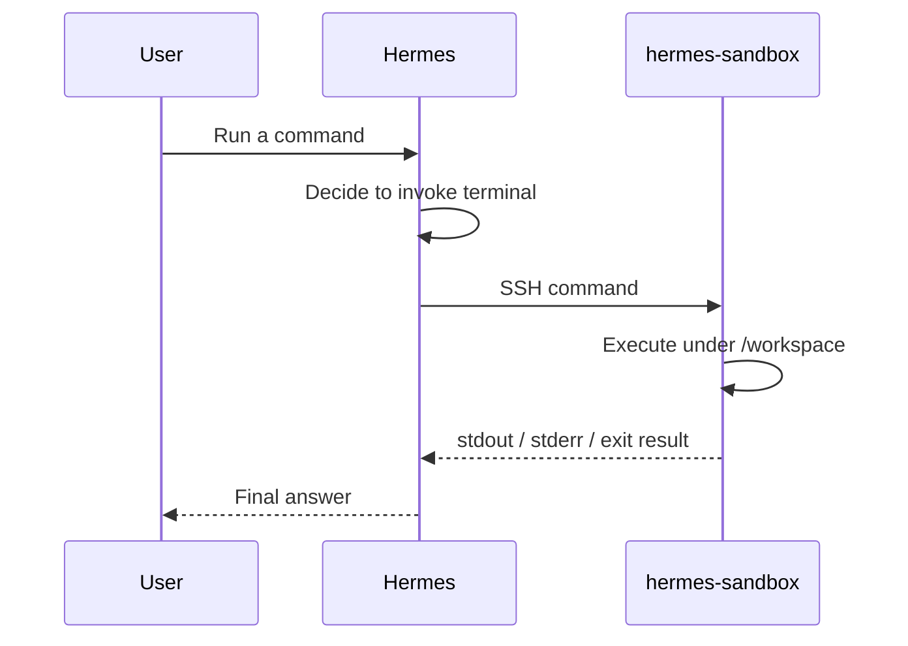

# Stack6 - Hermes Agent

Stack6 provides the agent/orchestration layer for the `local_hybrid_ai` platform.

Its main responsibilities are:

- running **Hermes Agent**;
- routing all model access through **LiteLLM**;
- executing terminal operations only through an isolated **Hermes sandbox**;
- persisting Hermes runtime state separately from source configuration;
- maintaining Hermes long-term memory in a dedicated **Git-backed working tree**;
- exposing optional messaging / API interfaces without giving the agent Docker-host control.

The central design principle is:

> **Hermes orchestrates. It does not need to be the model runtime, and it must not execute arbitrary agent commands on the Docker host.**

---

## Components

### Hermes

Hermes is the agent layer. It is responsible for:

- receiving user messages;
- maintaining sessions and conversation state;
- deciding when tools are required;
- calling the configured model;
- invoking terminal operations through SSH;
- invoking search and extraction services;
- loading and applying skills;
- managing tool-calling loops;
- exposing optional dashboard / agent API endpoints;
- communicating through optional messaging integrations.

Hermes is **not** the model runtime.

Hermes is also **not** the execution sandbox.

### Hermes sandbox

The sandbox is the isolated execution environment used by the Hermes terminal tool.

Conceptually:

```text
Hermes
   |
   | SSH :2222 over hermes-exec
   v
hermes-sandbox
```

Commands execute inside the sandbox, normally under:

```text
/workspace
```

They do not execute on the Docker host.

### Git-backed memory

Hermes memory is stored in a separate persistent Git working tree:

```text
/opt/docker/runtime/service_-_hermes-memory/data
```

The working tree contains:

```text
MEMORY.md
USER.md
```

and tracks:

```text
ssh://git@gitea/ea1het/hermes-memory.git
```

on branch:

```text
main
```

Periodic synchronization is delegated to Stack7 / xyOps rather than hidden inside Stack6 startup or preparation.

---

## Version policy

Hermes is explicitly pinned:

```dotenv
HERMES_IMAGE=nousresearch/hermes-agent
HERMES_VERSION=v2026.8.31
```

Stack6 preparation rejects `latest`.

The temporary terminal-timeout workaround described later remains necessary for the validated version until the upstream issue is resolved.

---

## High-level architecture



---

## Network model

Hermes participates in two Docker-network domains.

### `redlocal`

Hermes uses `redlocal` to reach infrastructure services such as:

```text
litellm:4000
searxng:8080
firecrawl-api:3002
HAProxy
```

### `hermes-exec`

Hermes and the sandbox share a dedicated private execution bridge.

The sandbox is intentionally **not** attached to `redlocal`.

This limits the sandbox's visibility of the wider application environment while preserving the terminal-execution path.

---

## Model path

Hermes does not connect directly to the local inference runtime.

The intended path is:

```text
Hermes
   |
   v
LiteLLM
   |
   v
LM Studio / oMLX / selected local backend
```

This separates the agent from inference implementation details and keeps model-routing policy in LiteLLM.

The Hermes policy is deliberately strict:

- no provider fallback inside Hermes;
- no automatic external fallback;
- cloud routing, if introduced, belongs at LiteLLM;
- failure should be visible rather than silently redirected.

---

## Terminal execution

If a user asks Hermes to run a command, the command executes in:

```text
hermes-sandbox
```

normally under:

```text
/workspace
```

The execution flow is:



The command does **not** execute:

- on the Docker host;
- through a Docker socket;
- inside the Hermes orchestration container as host-equivalent execution.

---

## SSH trust between Hermes and the sandbox

Hermes keeps its client key pair under:

```text
/opt/docker/runtime/service_-_hermes/config/ssh/
├── hermes_executor_ed25519
└── hermes_executor_ed25519.pub
```

The public key is installed into:

```text
/opt/docker/runtime/service_-_hermes-sandbox/data/home/.ssh/authorized_keys
```

The sandbox SSH host identity is stored under:

```text
/opt/docker/runtime/service_-_hermes-sandbox/config/ssh-host/
├── ssh_host_ed25519_key
└── ssh_host_ed25519_key.pub
```

Client identity and server identity are infrastructure state and survive normal application-state resets.

---

## Source and runtime layout

Stack source:

```text
/opt/docker/stacks/stack6_-_hermes/
```

Persistent runtime:

```text
/opt/docker/runtime/
├── service_-_hermes/
├── service_-_hermes-sandbox/
└── service_-_hermes-memory/
```

The platform contract is:

```dotenv
STACKS_ROOT=/opt/docker/stacks
BASE_PATH=/opt/docker/runtime
```

Source configuration and runtime state must remain separate.

---

## Persistent filesystem layout

### Hermes

```text
/opt/docker/runtime/service_-_hermes/
├── config/
│   ├── config.yaml
│   └── ssh/
│       ├── hermes_executor_ed25519
│       └── hermes_executor_ed25519.pub
├── data/
├── logs/
└── ...
```

Hermes creates mutable runtime content below `data/`.

Observed classes of state include:

```text
.env
config.yaml
sessions/
state.db
cron/
skills/
hooks/
platforms/
pending_messages/
workspace/
cache/
kanban*
gateway_state.json
channel_directory.json
```

These are runtime artifacts, not the authoritative stack source.

### Sandbox

```text
/opt/docker/runtime/service_-_hermes-sandbox/
├── config/
│   ├── Dockerfile
│   ├── entrypoint.sh
│   └── ssh-host/
├── data/
│   ├── home/
│   │   └── .ssh/
│   │       └── authorized_keys
│   └── workspace/
└── logs/
```

The current workspace contains a persistent Python virtual environment:

```text
/workspace/venv
```

This is why age-only cleanup such as "delete files older than N days" is not safe.

### Git-backed memory

```text
/opt/docker/runtime/service_-_hermes-memory/
└── data/
    ├── .git/
    ├── MEMORY.md
    └── USER.md
```

The working tree is mounted into Hermes at:

```text
/opt/data/memories
```

It is a separate lifecycle and source of truth for long-term memory.

---

## Managed configuration versus runtime state

The authoritative managed Hermes configuration is:

```text
/opt/docker/runtime/service_-_hermes/config/config.yaml
```

Hermes may also create runtime shadow files such as:

```text
/opt/docker/runtime/service_-_hermes/data/config.yaml
/opt/docker/runtime/service_-_hermes/data/.env
```

These must not be confused with the managed source of truth.

Current Stack6 policy distinguishes:

- legitimate runtime `.env` state that must be preserved and audited;
- backup files such as `.env.bak-*` and `config.yaml.bak-*`;
- empty runtime `config.yaml` that may appear during preparation but is removed as an active shadow;
- non-empty or symlinked runtime `config.yaml`, which is rejected;
- `.hermes` shadow state, which is rejected / removed by cleanup policy.

The design principle is:

> **Treat effective runtime configuration as something that must be audited, not assumed.**

---

## `01-prepare.sh`

`01-prepare.sh` prepares and audits the deployment.

It does not silently rewrite `.env`.

Its responsibilities include:

- checking `.lock`;
- reading and validating `.env`;
- proving `.env` is unchanged;
- validating source files;
- validating the external Docker network;
- creating / verifying persistent directories;
- preserving legitimate persistent data;
- checking for stale shadow configuration;
- synchronizing managed Hermes configuration;
- validating model configuration;
- preserving SSH key pairs;
- recreating sandbox `authorized_keys`;
- validating dependencies;
- running `docker compose config --quiet`;
- auditing ownership and permissions;
- creating `.lock` only after successful completion.

Preparation is not responsible for periodic Git synchronization.

---

## `02-cleanup.sh`

`02-cleanup.sh` owns controlled removal of shadow / mutable state.

It is intentionally separate from preparation.

The cleanup contract protects infrastructure while allowing mutable Hermes state to be reset deliberately.

Do not use generic filesystem cleanup outside the documented policy, especially for:

```text
service_-_hermes-memory
service_-_hermes-sandbox/data/home
service_-_hermes-sandbox/data/workspace/venv
```

---

## `03-temporary-fix-issue-74116-terminal-timeout.sh`

Hermes `v2026.8.31` still requires the temporary workaround for the known terminal timeout issue.

The target operational value is:

```text
TERMINAL_TIMEOUT=300
```

The workaround has been validated at:

- Stack6 `.env`;
- container environment;
- Hermes runtime.

This is considered **mitigated, not upstream-resolved**.

The workaround remains a separate script so it can be removed cleanly when the upstream issue is fixed.

---

## `04-gitmem.sh`

`04-gitmem.sh` prepares and audits the Git-backed memory working tree.

Its contract includes:

- Stack6 must already be prepared;
- Hermes must be stopped while the memory mount is prepared / validated;
- `service_-_hermes-memory/data` is the real Git working tree;
- `MEMORY.md` and `USER.md` must exist;
- the expected branch is `main`;
- the expected origin is:

```text
ssh://git@gitea/ea1het/hermes-memory.git
```

- the script validates identity, structure and legacy-memory coherence;
- it deliberately does **not** pull, merge, rebase, commit or push.

Periodic synchronization is delegated to Stack7.

---

## Stack7 scheduler integration

Stack7 provides the scheduler / worker layer using **xyOps + xySat**.

The memory-sync path is:

```text
xyOps
   |
   v
xySat
   |
   v
/opt/xyops/jobs/hermes-memory-sync.sh
   |
   v
/work/hermes-memory
   |
   v
Gitea
```

The scheduler worker receives only the memory worktree as writable Stack6 state.

It does **not** receive:

- the complete Stack6 runtime;
- `/root/.ssh`;
- `/var/run/docker.sock`;
- unrestricted `/opt/docker`;
- the sandbox home directory.

### Hermes Memory Sync policy

The scheduled job supports these safe states:

```text
local == remote + no changes
    -> no-op

local == remote + MEMORY.md / USER.md changes
    -> commit + push

remote ahead + clean tree
    -> fast-forward

local ahead
    -> push
```

It refuses to automatically resolve:

- divergent history;
- remote-ahead state while unsaved local memory exists;
- changes outside `MEMORY.md` / `USER.md`;
- unexpected branch;
- unexpected origin.

It never force-pushes.

The job is protected by:

- xyOps maximum concurrent jobs = `1`;
- an internal `flock`;
- a maximum runtime of `300` seconds.

Current schedule:

```text
every 10 minutes
```

A manual trigger is retained for diagnostics.

### Ownership behavior

The xySat image runs its agent as root and does not contain a passwd entry for UID `10000`.

The memory-sync job therefore runs as root **inside xySat**, but its writable host scope remains limited to the memory working tree.

On exit, the script restores the Hermes memory ownership / permissions expected by Stack6:

```text
working tree: 10000:10000
MEMORY.md:    10000:10000 mode 0640
USER.md:      10000:10000 mode 0640
```

The security boundary is the explicit mount, not host-wide privilege.

---

## Sandbox housekeeping integration

Stack7 also audits the Hermes sandbox workspace.

The scheduler sees only:

```text
/opt/docker/runtime/service_-_hermes-sandbox/data/workspace
```

mounted read-only as:

```text
/work/hermes-sandbox
```

It does **not** receive:

```text
/opt/docker/runtime/service_-_hermes-sandbox/data/home
```

The current audit job:

- reports filesystem capacity;
- reports workspace size;
- lists top-level objects;
- lists symlinks;
- detects special objects;
- reports file-age statistics;
- recognizes `venv` as persistent;
- reports unclassified top-level objects.

It performs **no deletion**.

Current schedule:

```text
daily at 03:30 Europe/Madrid
```

Automatic deletion will only be introduced after a specific class of transient artifacts has a documented lifecycle.

---

## Starting Stack6

From:

```bash
cd /opt/docker/stacks/stack6_-_hermes
```

prepare:

```bash
./01-prepare.sh
```

prepare / validate Git-backed memory as required by the deployment lifecycle:

```bash
./04-gitmem.sh
```

then start:

```bash
docker compose up -d --build
docker compose ps
```

Apply the terminal-timeout workaround while the upstream issue remains:

```bash
./03-temporary-fix-issue-74116-terminal-timeout.sh
```

Expected core services:

```text
hermes
hermes-sandbox
```

both healthy.

---

## Security model

Hermes and its sandbox are deliberately designed without:

- `/var/run/docker.sock`;
- privileged mode;
- host networking;
- unrestricted host filesystem access.

The sandbox is read-only at its image root and receives only its explicit persistent data / host-key mounts.

The sandbox does not receive:

- LiteLLM provider credentials;
- model-provider credentials;
- messaging secrets;
- Docker host access.

Stack7 does not weaken this boundary.

Its xySat worker has explicit, minimal mounts for:

- Hermes memory synchronization;
- read-only sandbox workspace audit;
- scheduler-specific Gitea SSH identity.

---

## Secrets

Do not commit:

- Stack6 `.env`;
- LiteLLM virtual keys;
- Telegram / Buzz credentials;
- Hermes API keys;
- SSH private keys;
- runtime state databases;
- Stack7 xySat `config.json`;
- scheduler private keys;
- xyOps bootstrap tokens.

---

## Validated paths

The following paths have been validated:

```text
Hermes -> LiteLLM -> local inference
Hermes -> SSH -> hermes-sandbox
Hermes -> SearXNG
Hermes -> Firecrawl
Hermes -> Git-backed memory

xyOps -> xySat -> Hermes Memory Sync -> Gitea
xyOps -> xySat -> Hermes Sandbox Audit
```

The memory job has been validated for:

- clean no-op;
- real file modification;
- commit;
- push;
- restoration;
- local / remote equality;
- automatic scheduled execution.

The sandbox audit has been validated through xyOps with the workspace mounted read-only.

---

## Operational principle

> **Hermes orchestrates; the sandbox executes; LiteLLM controls model access; Git preserves memory; xyOps schedules controlled maintenance.**

Each responsibility remains behind its own explicit boundary.


