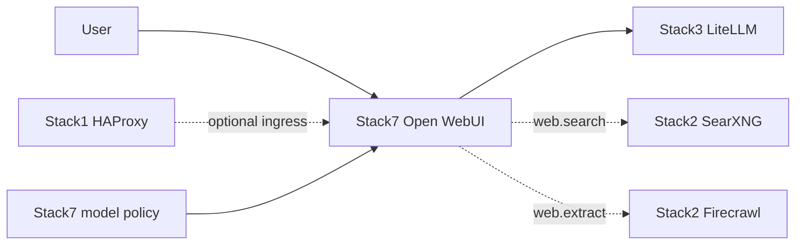

<!--
This Source Code Form is subject to the terms of the Mozilla Public
License, v. 2.0. If a copy of the MPL was not distributed with this
file, You can obtain one at https://mozilla.org/MPL/2.0/.
-->

# Stack7 — Open WebUI

[Documentation TOC](../docs/TOC.md) · [Stack map](../docs/stacks/README.md) · [OpenSpec contract](../docs/devel-docs/openspec/stacks/stack7.feature)

Stack7 is the curated user chat surface. It consumes the Stack3 AI gateway, can consume Stack2 local web capabilities and may be published through Stack1 ingress. Model access is explicit rather than globally bypassed.



## Contract

- **Requires:** Stack0 and Stack3.
- **Optional:** Stack1 ingress and Stack2 web capabilities.
- **Default model:** `basic_autorouter`.
- **Access policy:** Arena disabled; `basic_autorouter` receives explicit public-read access; global access bypass remains disabled.
- **Web behaviour:** new chats start with web search enabled when the capability exists, while users retain the ability to disable it.
- **DR:** `/app/backend/data` is persistent sensitive state and is archived; `OPENWEBUI_SECRET_KEY` is persistent installation identity in protected configuration.

## Policy lifecycle

Stack7 model policy is reconciled through the supported `./local-ai` lifecycle. Before the first real administrator exists, reconciliation intentionally reports a deferred/bootstrap-safe state rather than failing initial deployment. After an administrator exists, reconciliation becomes idempotent and verification requires the declared access/default-feature policy.

The stack-owned reconciliation and verification Python programs are implementation details. Operators use:

```bash
./local-ai install 7 --reconcile --yes
```

The reconciler ensures `basic_autorouter` is active, explicitly readable and configured with `web_search` in its default feature identifiers. Verification is read-only and checks the same contract.

## Optional web capability

Stack2 is not a required dependency. Without a READY Stack2 provider, Stack7 must not silently route web requests to an undeclared external provider. When Stack2 becomes READY, capability reconciliation enables the configured local web integration.

## Security invariants

- Model access is granted explicitly; global bypass stays disabled.
- Persistent Open WebUI identity/state is included in its recovery contract.
- AI provider credentials remain behind Stack3; Stack7 receives scoped gateway access.
- Optional web capability is local and explicit rather than an implicit cloud fallback.
- `./local-ai` remains the supported management boundary.

## Related decisions

- [SDR-0003 — least-privilege AI gateway credentials](../docs/devel-docs/sdr/0003-least-privilege-ai-gateway-credentials.md)
- [SDR-0005 — explicit Open WebUI model access](../docs/devel-docs/sdr/0005-open-webui-explicit-model-access.md)
- [Stack7 DR qualification](../docs/dr/status.md)
- [CLI reference](../docs/user-docs/cli.md)

Key implementation files: `docker-compose.yml`, `00-bootstrap-env.py`, model-policy reconcile/verify programs, `manifest.json`, and stack lifecycle scripts.
